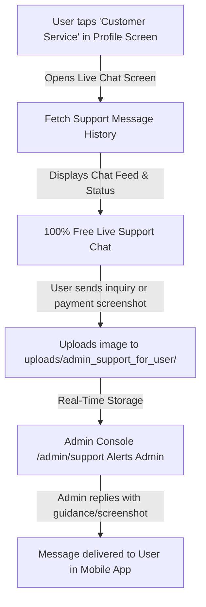

# ChinChins Live - 24/7 Customer Service & Live Admin Support RESTful API Documentation

Complete specification and Flutter Mobile Client Integration Guide for **Customer Service & 24/7 Live Support Chat with Platform Administration**.

---

## 🎧 Architecture & Business Rules



### 📋 Core Policies:
1. **100% Free of Charge:** Live chat with platform administration is completely free. No coins or gems are deducted for text messages, screenshot attachments, or voice notes.
2. **Dedicated Upload Directory:** All support screenshots and images uploaded by users or admins are stored in:
   `public/uploads/admin_support_for_user/`
3. **Admin Live Console:** All user inquiries appear in the Admin Panel at `/admin/support` (`Live Chat Users` in sidebar) with real-time unread badge alerts.

---

## 🔑 Headers & Authentication

```http
Authorization: Bearer <user_sanctum_token>
Content-Type: application/json
Accept: application/json
```

---

## 📥 API 1: Fetch Support Messages & History

Retrieves all message history between the authenticated user and platform administration. Automatically marks admin replies as read.

- **Method:** `GET`
- **Endpoint:** `/api/support/messages`
- **Authentication:** Required (Bearer Token)

### Response (`200 OK`):
```json
{
  "status": true,
  "message": "Support messages retrieved successfully.",
  "support_title": "Customer Service 24/7",
  "support_subtitle": "Official ChinChins Live Platform Support",
  "is_free": true,
  "user": {
    "id": 42,
    "account_id": "45311597",
    "name": "Ruma",
    "avatar": "https://chinchins.live/uploads/avatars/ruma.jpg",
    "coins": 7560
  },
  "data": [
    {
      "id": 1,
      "user_id": 42,
      "sender_type": "user",
      "is_me": true,
      "sender_name": "Ruma",
      "type": "text",
      "message": "Hello admin, I sent money for 7,560 gems via bKash. Here is my screenshot.",
      "media_url": null,
      "is_read": true,
      "created_at": "2026-09-09T11:00:00.000000Z",
      "formatted_time": "11:00 AM"
    },
    {
      "id": 2,
      "user_id": 42,
      "sender_type": "user",
      "is_me": true,
      "sender_name": "Ruma",
      "type": "image",
      "message": null,
      "media_url": "https://chinchins.live/uploads/admin_support_for_user/support_1725854000.jpg",
      "is_read": true,
      "created_at": "2026-09-09T11:00:30.000000Z",
      "formatted_time": "11:00 AM"
    },
    {
      "id": 3,
      "user_id": 42,
      "sender_type": "admin",
      "is_me": false,
      "sender_name": "ChinChins Official Support",
      "type": "text",
      "message": "Hello Ruma! We verified your payment. Your 7,560 gems have been credited. Enjoy streaming!",
      "media_url": null,
      "is_read": true,
      "created_at": "2026-09-09T11:02:15.000000Z",
      "formatted_time": "11:02 AM"
    }
  ]
}
```

---

## 📤 API 2: Send Message to Admin Support

Sends text message, screenshot/image attachment, or voice note to Platform Admin.

- **Method:** `POST`
- **Endpoint:** `/api/support/send`
- **Content-Type:** `multipart/form-data` or `application/json`
- **Authentication:** Required (Bearer Token)

### Request Parameters:
| Field | Type | Required | Description |
|---|---|---|---|
| `message` | string | Optional | Text message content |
| `type` | string | Optional | `'text'`, `'image'`, `'voice'` |
| `image` / `screenshot` / `file` | file | Optional | Screenshot proof / image file |
| `voice` / `audio` | file | Optional | Voice recording audio file |

### Response (`201 Created`):
```json
{
  "status": true,
  "message": "Message sent to Admin Support successfully.",
  "data": {
    "id": 4,
    "user_id": 42,
    "sender_type": "user",
    "is_me": true,
    "sender_name": "Ruma",
    "type": "image",
    "message": "Please check my deposit status.",
    "media_url": "https://chinchins.live/uploads/admin_support_for_user/support_1725854200.jpg",
    "is_read": false,
    "created_at": "2026-09-09T11:05:00.000000Z",
    "formatted_time": "11:05 AM"
  }
}
```

---

## 🖼️ API 3: Upload Support Media File (Standalone)

- **Method:** `POST`
- **Endpoint:** `/api/support/upload`
- **Content-Type:** `multipart/form-data`
- **Form-Data:** `file` (Image max 15MB)

### Response (`200 OK`):
```json
{
  "status": true,
  "message": "Attachment uploaded successfully.",
  "media_url": "https://chinchins.live/uploads/admin_support_for_user/support_img_1725854300.png",
  "relative_path": "uploads/admin_support_for_user/support_img_1725854300.png",
  "type": "image"
}
```

---

## 🔔 API 4: Unread Admin Messages Counter

- **Method:** `GET`
- **Endpoint:** `/api/support/unread-count`

### Response (`200 OK`):
```json
{
  "status": true,
  "unread_count": 2
}
```

---

## 🖥️ Admin Live Support Console (`Web`)

- **URL:** `https://chinchins.live/admin/support` (Local: `http://127.0.0.1:8000/admin/support`)
- **Sidebar Menu:** **Live Chat Users** (`fa-headset` under MANAGEMENT with real-time unread counter).
- **Features:**
  - Real-time list of all user inquiries (sorted with latest messages on top).
  - Quick view of User Account ID, Name, Avatar, and Coin Balance.
  - Reply with text message and image screenshot attachments.
  - One-click direct link to User Profile (`/admin/users/{id}`).

---

## 📱 Flutter Implementation Example

### 1. Data Model (`Dart`)

```dart
class SupportMessageModel {
  final int id;
  final int userId;
  final String senderType; // 'user' or 'admin'
  final bool isMe;
  final String senderName;
  final String type; // 'text', 'image', 'voice'
  final String? message;
  final String? mediaUrl;
  final bool isRead;
  final String formattedTime;

  SupportMessageModel({
    required this.id,
    required this.userId,
    required this.senderType,
    required this.isMe,
    required this.senderName,
    required this.type,
    this.message,
    this.mediaUrl,
    required this.isRead,
    required this.formattedTime,
  });

  factory SupportMessageModel.fromJson(Map<String, dynamic> json) {
    return SupportMessageModel(
      id: json['id'] ?? 0,
      userId: json['user_id'] ?? 0,
      senderType: json['sender_type'] ?? 'user',
      isMe: json['is_me'] ?? (json['sender_type'] == 'user'),
      senderName: json['sender_name'] ?? 'Support',
      type: json['type'] ?? 'text',
      message: json['message'],
      mediaUrl: json['media_url'],
      isRead: json['is_read'] ?? false,
      formattedTime: json['formatted_time'] ?? '',
    );
  }
}
```

### 2. Opening Customer Service from Profile ("Me") Screen

```dart
void openCustomerServiceChat(BuildContext context) {
  Navigator.push(
    context,
    MaterialPageRoute(
      builder: (context) => const AdminLiveSupportScreen(),
    ),
  );
}
```
