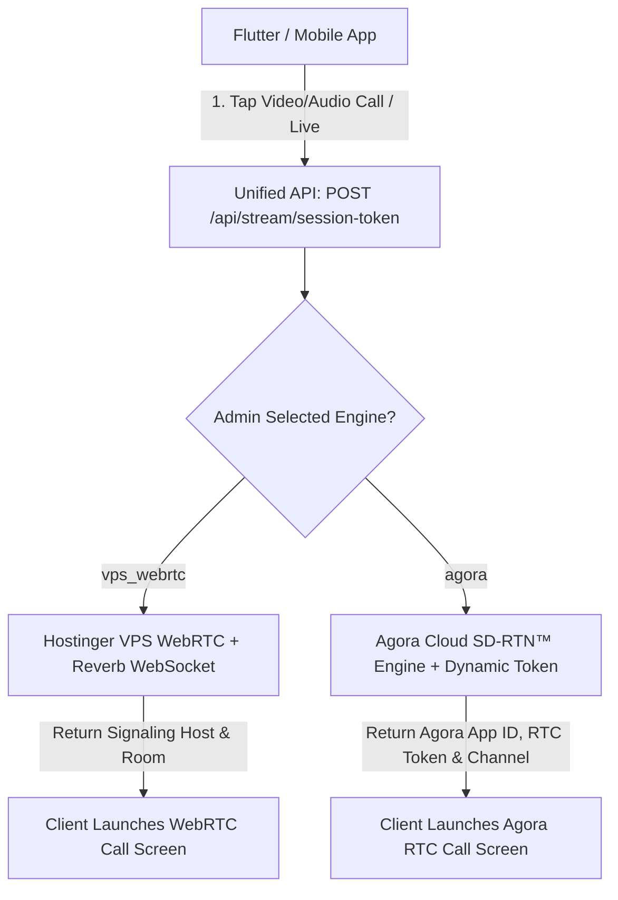

# ⚡ Dynamic Dual-Engine Streaming & Video Calling Architecture
## Laravel 11+ Backend & Flutter Client Implementation Guide: Hostinger VPS WebRTC + Agora RTC/RTM Hybrid
> **Chinchins Live Real-Time Media Infrastructure**  
> **Backend Base URL:** `https://chinchins.live/api` (Production) | `http://127.0.0.1:8000/api` (Local Dev)  
> **Status:** ✅ Production Ready & Fully Tested in Database & Admin Panel

---

## 📌 Executive Summary & Architecture Overview



### 🎯 মূল লক্ষ্য ও কার্যপ্রণালী (Core Purpose):
1. **মেসেঞ্জার, ইমেজ আপলোড ও সাধারণ চ্যাট অপরিবর্তিত:** চ্যাট মেসেজিং, ছবি আপলোড, ডাটাবেজ চ্যাট হিস্ট্রি এবং কয়েন ট্রান্সফার সম্পূর্ণরূপে বর্তমান লারাভেল VPS ও ডাটাবেজেই সংরক্ষিত থাকবে। এতে কোনো হাত দেওয়ার প্রয়োজন নেই।
2. **ডায়নামিক ১-ক্লিক সুইচ (Admin Panel 1-Click Engine Toggle):** এডমিন প্যানেল (`/admin/settings` &rarr; `⚡ Streaming Engine`) থেকে মাত্র ১টি টগল সুইচের মাধ্যমে যেকোনো সময় কলিং ইঞ্জিন পরিবর্তন করা যাবে:
   * **Hostinger VPS Mode (`vps_webrtc`):** Laravel Reverb WebSocket সিগন্যালিং + WebRTC Peer-to-Peer। (১০০% ফ্রি, নো থার্ড-পার্টি বিলিং, আনলিমিটেড মিনিট)।
   * **Agora Cloud Mode (`agora`):** Agora RTC Engine (Global SD-RTN™ Edge Network, 1080p 60fps ক্রিস্টাল ক্লিয়ার কলিং, বিল্ট-ইন এআই নয়েজ ক্যান্সেলেশন)।
3. **ফ্লাটার ক্লায়েন্ট ডায়নামিক অ্যাডাপ্টার:** ফ্লাটার অ্যাপ কল শুরু করার আগে `/api/stream/session-token` থেকে `driver` ফিল্ড চেক করে স্বয়ংক্রিয়ভাবে সংশ্লিষ্ট কলিং স্ক্রিন ওপেন করবে। কোনো ম্যানুয়াল APK রিলিজের প্রয়োজন হবে না।

---

## 🗄️ ১. ডাটাবেজ ও মডেল আর্কিটেকচার (Laravel Database Schema)

### `streaming_settings` টেবিল মাইগ্রেশন:
```php
Schema::create('streaming_settings', function (Blueprint $table) {
    $table->id();
    $table->string('active_driver', 30)->default('vps_webrtc'); // 'vps_webrtc' or 'agora'
    $table->string('agora_project_name')->nullable();           // e.g. 'Default Project'
    $table->string('agora_app_id')->nullable();                 // App ID from Agora Console
    $table->text('agora_app_certificate')->nullable();          // Primary Certificate from Agora Console
    $table->boolean('enable_video_call')->default(true);
    $table->boolean('enable_audio_call')->default(true);
    $table->boolean('enable_live_stream')->default(true);
    $table->string('reverb_host')->nullable();
    $table->integer('reverb_port')->nullable();
    $table->integer('token_expire_seconds')->default(86400);     // 24 Hours
    $table->timestamps();
});
```

---

## 🔗 ২. ইউনিফাইড ব্যাকএন্ড API এন্ডপয়েন্টস (Unified API Endpoints)

| Method | Endpoint | Description | Auth |
| :--- | :--- | :--- | :--- |
| `POST` / `GET` | `/api/stream/session-token` | **প্রাইমারি কল/লাইভ সেশন টোকেন ইনিশিয়ালাইজার** | Optional / Bearer Token |
| `POST` / `GET` | `/api/v1/stream/initialize` | ভেন্ডর-নিউট্রাল এলিয়াস | Optional / Bearer Token |
| `GET` | `/api/stream/driver` | বর্তমান অ্যাক্টিভ ড্রাইভ ও কনফিগারেশন চেক | Public |
| `GET` | `/api/v1/config/streaming-driver` | কনফিগ এলিয়াস | Public |

---

## 📥 ৩. কল ইনিশিয়ালাইজেশন রিকোয়েস্ট ও রেসপন্স ফরম্যাট

### 📡 API রিকোয়েস্ট:
```http
POST /api/stream/session-token HTTP/1.1
Host: chinchins.live
Authorization: Bearer YOUR_SANCTUM_TOKEN
Content-Type: application/json
Accept: application/json

{
  "channel_name": "chinchins_room_849201",
  "call_type": "video",
  "role": "publisher"
}
```

---

### 📤 কেস ১: এডমিনে যখন **Agora Cloud** অ্যাক্টিভ (`driver == 'agora'`)
```json
{
  "success": true,
  "status": true,
  "driver": "agora",
  "channel_name": "chinchins_room_849201",
  "agora_app_id": "98a76bc3d1234567890abcdef",
  "agora_token": "006MDA2ZGVmYXVsdF9hcHBfaWQ...",
  "agora_uid": 14,
  "user_id": 14,
  "account_id": "84920183",
  "call_type": "video",
  "role": "publisher",
  "expire_seconds": 86400,
  "enable_video": true,
  "enable_audio": true,
  "enable_live": true,
  "message": "Connected via Agora Cloud Engine"
}
```

---

### 📤 কেস ২: এডমিনে যখন **Hostinger VPS WebRTC** অ্যাক্টিভ (`driver == 'vps_webrtc'`)
```json
{
  "success": true,
  "status": true,
  "driver": "vps_webrtc",
  "channel_name": "chinchins_room_849201",
  "user_id": 14,
  "account_id": "84920183",
  "call_type": "video",
  "role": "publisher",
  "signaling_host": "chinchins.live",
  "signaling_port": 443,
  "signaling_scheme": "https",
  "reverb_app_key": "chinchins_reverb_key",
  "auth_endpoint": "https://chinchins.live/api/broadcasting/auth",
  "enable_video": true,
  "enable_audio": true,
  "enable_live": true,
  "message": "Connected via VPS WebRTC + Reverb Engine"
}
```

---

## 📱 ৪. ফ্লাটার ক্লায়েন্ট ইমপ্লিমেন্টেশন গাইড (Flutter Client Integration)

### ১. `pubspec.yaml` ডিপেন্ডেন্সি:
```yaml
dependencies:
  flutter:
    sdk: flutter
  agora_rtc_engine: ^6.3.0
  permission_handler: ^11.3.1
  http: ^1.2.0
  flutter_webrtc: ^0.10.6
```

---

### ২. `StreamingService.dart` (Dynamic Router Controller):
```dart
import 'dart:convert';
import 'package:flutter/material.dart';
import 'package:http/http.dart' as http;
import 'package:permission_handler/permission_handler.dart';
import 'agora_call_screen.dart';
import 'existing_webrtc_call_screen.dart';

class StreamingService {
  static const String baseUrl = 'https://chinchins.live/api';

  /// Request permissions and dynamically initiate Agora or WebRTC Call
  static Future<void> startCall({
    required BuildContext context,
    required String channelName,
    required String callType, // 'video' or 'audio'
    required String userToken,
  }) async {
    // 1. Request Camera and Microphone permissions
    await [Permission.camera, Permission.microphone].request();

    // 2. Fetch Session Token & Active Driver from Backend
    try {
      final res = await http.post(
        Uri.parse('$baseUrl/stream/session-token'),
        headers: {
          'Authorization': 'Bearer $userToken',
          'Accept': 'application/json',
          'Content-Type': 'application/json',
        },
        body: jsonEncode({
          'channel_name': channelName,
          'call_type': callType,
          'role': 'publisher',
        }),
      );

      if (res.statusCode != 200) {
        ScaffoldMessenger.of(context).showSnackBar(
          SnackBar(content: Text('Failed to initiate call: ${res.body}')),
        );
        return;
      }

      final data = jsonDecode(res.body);

      // 3. Dynamic Engine Switcher Routing
      if (data['driver'] == 'agora') {
        // Launch Agora Cloud Engine Screen
        Navigator.push(
          context,
          MaterialPageRoute(
            builder: (context) => AgoraCallScreen(
              appId: data['agora_app_id'],
              token: data['agora_token'],
              channelName: data['channel_name'],
              uid: (data['agora_uid'] as num).toInt(),
              isVideo: callType == 'video',
            ),
          ),
        );
      } else {
        // Launch Existing Hostinger VPS WebRTC Screen
        Navigator.push(
          context,
          MaterialPageRoute(
            builder: (context) => ExistingWebRTCCallScreen(
              channelName: data['channel_name'],
              signalingHost: data['signaling_host'] ?? 'chinchins.live',
            ),
          ),
        );
      }
    } catch (e) {
      ScaffoldMessenger.of(context).showSnackBar(
        SnackBar(content: Text('Network error: $e')),
      );
    }
  }
}
```

---

### ৩. `AgoraCallScreen.dart` (Complete Production RTC Lifecycle):
```dart
import 'package:agora_rtc_engine/agora_rtc_engine.dart';
import 'package:flutter/material.dart';

class AgoraCallScreen extends StatefulWidget {
  final String appId;
  final String token;
  final String channelName;
  final int uid;
  final bool isVideo;

  const AgoraCallScreen({
    Key? key,
    required this.appId,
    required this.token,
    required this.channelName,
    required this.uid,
    this.isVideo = true,
  }) : super(key: key);

  @override
  State<AgoraCallScreen> createState() => _AgoraCallScreenState();
}

class _AgoraCallScreenState extends State<AgoraCallScreen> {
  int? _remoteUid;
  bool _localUserJoined = false;
  late RtcEngine _engine;
  bool _muted = false;

  @override
  void initState() {
    super.initState();
    _initAgora();
  }

  Future<void> _initAgora() async {
    // Initialize Agora Engine
    _engine = createAgoraRtcEngine();
    await _engine.initialize(RtcEngineContext(
      appId: widget.appId,
      channelProfile: ChannelProfileType.channelProfileCommunication,
    ));

    _engine.registerEventHandler(
      RtcEngineEventHandler(
        onJoinChannelSuccess: (RtcConnection connection, int elapsed) {
          setState(() => _localUserJoined = true);
        },
        onUserJoined: (RtcConnection connection, int remoteUid, int elapsed) {
          setState(() => _remoteUid = remoteUid);
        },
        onUserOffline: (RtcConnection connection, int remoteUid, UserOfflineReasonType reason) {
          setState(() => _remoteUid = null);
          Navigator.of(context).pop(); // End call when remote hangs up
        },
      ),
    );

    if (widget.isVideo) {
      await _engine.enableVideo();
      await _engine.startPreview();
    } else {
      await _engine.enableAudio();
    }

    // Join Agora RTC Channel using dynamic token
    await _engine.joinChannel(
      token: widget.token,
      channelId: widget.channelName,
      uid: widget.uid,
      options: ChannelMediaOptions(
        clientRoleType: ClientRoleType.clientRoleBroadcaster,
        channelProfile: ChannelProfileType.channelProfileCommunication,
      ),
    );
  }

  @override
  void dispose() {
    _dispose();
    super.dispose();
  }

  Future<void> _dispose() async {
    await _engine.leaveChannel();
    await _engine.release();
  }

  @override
  Widget build(BuildContext context) {
    return Scaffold(
      backgroundColor: Colors.black,
      body: Stack(
        children: [
          // Remote Video View
          Center(
            child: _remoteUid != null && widget.isVideo
                ? AgoraVideoView(
                    controller: VideoViewController.remote(
                      rtcEngine: _engine,
                      canvas: VideoCanvas(uid: _remoteUid),
                      connection: RtcConnection(channelId: widget.channelName),
                    ),
                  )
                : const Center(
                    child: Text(
                      'Connecting to Host...',
                      style: TextStyle(color: Colors.white70, fontSize: 16),
                    ),
                  ),
          ),

          // Local Video Preview (Picture in Picture)
          if (widget.isVideo && _localUserJoined)
            Positioned(
              top: 50,
              right: 20,
              width: 110,
              height: 160,
              child: ClipRRect(
                borderRadius: BorderRadius.circular(16),
                child: AgoraVideoView(
                  controller: VideoViewController(
                    rtcEngine: _engine,
                    canvas: const VideoCanvas(uid: 0),
                  ),
                ),
              ),
            ),

          // Control Toolbar (Mute, Camera Switch, Hang up)
          Positioned(
            bottom: 40,
            left: 0,
            right: 0,
            child: Row(
              mainAxisAlignment: MainAxisAlignment.center,
              children: [
                // Mute Mic
                IconButton(
                  iconSize: 32,
                  icon: Icon(_muted ? Icons.mic_off : Icons.mic, color: Colors.white),
                  onPressed: () {
                    setState(() => _muted = !_muted);
                    _engine.muteLocalAudioStream(_muted);
                  },
                ),
                const SizedBox(width: 24),

                // End Call Button
                FloatingActionButton(
                  backgroundColor: Colors.redAccent,
                  child: const Icon(Icons.call_end, color: Colors.white),
                  onPressed: () => Navigator.of(context).pop(),
                ),
                const SizedBox(width: 24),

                // Switch Camera
                if (widget.isVideo)
                  IconButton(
                    iconSize: 32,
                    icon: const Icon(Icons.switch_camera, color: Colors.white),
                    onPressed: () => _engine.switchCamera(),
                  ),
              ],
            ),
          ),
        ],
      ),
    );
  }
}
```

---

## 🛠️ ৫. এডমিন প্যানেল কনফিগারেশন গাইড (Admin Guide)

1. এডমিন ড্যাশবোর্ডে লগইন করুন: `https://chinchins.live/admin/settings`
2. **"⚡ Streaming Engine (Agora vs VPS)"** ট্যাবে ক্লিক করুন।
3. **Engine নির্বাচন করুন:**
   * `Hostinger VPS (WebRTC + Reverb)` অথবা `Agora Cloud Engine (RTC/RTM)`।
4. **Agora Credential দিন:**
   * **Agora Project Name:** `Default Project`
   * **Agora App ID:** আপনার Agora Console Basic Settings থেকে কপি করা App ID পেস্ট করুন।
   * **Agora Primary Certificate:** Agora Console Security Settings থেকে কপি করা Primary Certificate পেস্ট করুন।
5. **"Save Engine Configurations"** বাটনে ক্লিক করুন।
6. সাথে সাথে সমস্ত মোবাইল অ্যাপ কোনো রিবিল্ড ছাড়াই নতুন ইঞ্জিনে কানেক্ট হতে শুরু করবে!
