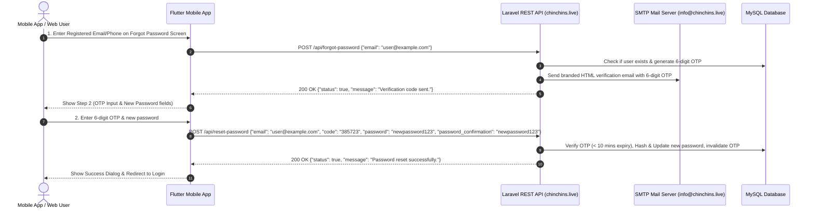

# ChinChins Live — Forgot Password & Password Recovery API Documentation

> **Base Production URL:** `https://chinchins.live/api`  
> **From Email:** `info@chinchins.live` (ChinChins Live)  
> **Protocol:** JSON REST API  

---

## 📑 Overview of Password Recovery Flow



---

## 🛠️ Mail Server (.env) Configuration

The backend is pre-configured with the following mail environment settings:

```env
MAIL_MAILER=smtp
MAIL_HOST=127.0.0.1
MAIL_PORT=25
MAIL_USERNAME=null
MAIL_PASSWORD=null
MAIL_ENCRYPTION=null
MAIL_FROM_ADDRESS="info@chinchins.live"
MAIL_FROM_NAME="ChinChins"
```

---

## 📡 API Endpoints Specification

### 1. Send Password Reset Code (6-Digit OTP)

Generates a secure 6-digit verification code, stores it in `password_reset_tokens` table with a 10-minute validity window, and dispatches a branded HTML email to the user's email address.

- **Endpoints:**
  - `POST /api/forgot-password`
  - `POST /api/password/forgot`
  - `POST /api/password/send-code`
  - `POST /api/password/email`
- **Headers:**
  - `Accept: application/json`
  - `Content-Type: application/json`

#### Request Body:
```json
{
  "email": "user@example.com",
  "method": "email"
}
```
*(Or for phone: `{"phone": "01700000000", "method": "phone"}`)*

#### Sample Success Response (`200 OK`):
```json
{
  "status": true,
  "message": "A 6-digit verification code has been sent to u***@example.com.",
  "data": {
    "method": "email",
    "recipient": "u***@example.com",
    "expires_in_minutes": 10,
    "user_id": 1
  }
}
```

#### Sample Error Response (`404 Not Found`):
```json
{
  "status": false,
  "message": "We could not find an account associated with this email address."
}
```

---

### 2. Verify 6-Digit OTP Code (Optional / Real-time check)

Allows pre-validating the OTP before showing password input or obtaining a signed reset token.

- **Endpoints:**
  - `POST /api/verify-reset-code`
  - `POST /api/password/verify-code`
  - `POST /api/password/verify-otp`

#### Request Body:
```json
{
  "email": "user@example.com",
  "code": "385723"
}
```

#### Sample Success Response (`200 OK`):
```json
{
  "status": true,
  "message": "Verification code confirmed successfully.",
  "data": {
    "verified": true,
    "reset_token": "Y9QrIYQdyx95P0rqQqZvDACHUVRQ1VPR3cSsxHku",
    "identifier": "user@example.com"
  }
}
```

---

### 3. Reset Password

Verifies the 6-digit code or reset token, hashes the new password with `bcrypt`, updates user record, and destroys the OTP so it cannot be re-used. Also revokes all old API sessions for security.

- **Endpoints:**
  - `POST /api/reset-password`
  - `POST /api/password/reset`

#### Request Body:
```json
{
  "email": "user@example.com",
  "code": "385723",
  "password": "newSecurePassword123",
  "password_confirmation": "newSecurePassword123"
}
```

#### Sample Success Response (`200 OK`):
```json
{
  "status": true,
  "message": "Your password has been successfully reset! You can now log in with your new password.",
  "data": {
    "user_id": 1,
    "email": "user@example.com"
  }
}
```

#### Sample Error Response (`422 Unprocessable Content`):
```json
{
  "status": false,
  "message": "Invalid or expired password reset session. Please request a new verification code."
}
```

---

## 📱 Mobile App (Flutter) Integration Guide

### 1. API Service Calls (`AuthApiService`):
- `AuthApiService.sendForgotPasswordCode(identifier: email, method: 'email')`
- `AuthApiService.resetPassword(identifier: email, code: otp, password: pass, passwordConfirmation: confirmPass)`

### 2. UI Flow:
1. **Screen 1 (`Recover Your Account`):**
   - User enters email or phone.
   - User taps **"Send Verification Code"** button.
   - On response success, transitions smoothly to Step 2 and starts a 60-second countdown for "Resend Code".
2. **Screen 2 (`Set New Password`):**
   - User inputs 6-digit OTP code received in email/SMS.
   - User inputs new password and confirms password.
   - User taps **"Reset Password"** button.
   - On success, displays glowing success modal and returns to Sign In screen.
