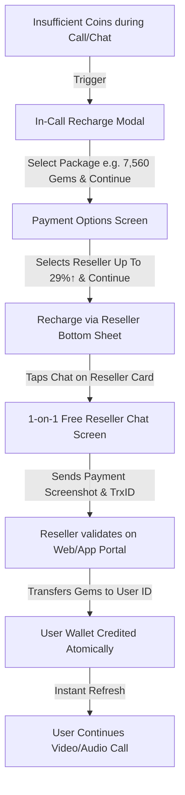

# ChinChins Live - Payment Methods, Reseller System & Account Lifecycle RESTful API Documentation

Master API Reference & Flutter Integration Blueprint for the **ChinChins Live Mobile Application & Web Administration Platform**.

---

## 📑 Table of Contents
1. [Architecture & System Overview](#1-architecture--system-overview)
2. [Screen 1: In-App & In-Call Recharge Modal](#2-screen-1-in-app--in-call-recharge-modal)
3. [Screen 2: Payment Options Screen](#3-screen-2-payment-options-screen)
4. [Screen 3: Recharge via Reseller Bottom Sheet](#4-screen-3-recharge-via-reseller-bottom-sheet)
5. [Screen 4: 1-on-1 Free Reseller Live Chat Screen](#5-screen-4-1-on-1-free-reseller-live-chat-screen)
6. [Screen 5: Reseller Operations & Instant Coin Transfers](#6-screen-5-reseller-operations--instant-coin-transfers)
7. [Google Play In-App Purchase (IAP) Integration Guide](#7-google-play-in-app-purchase-iap-integration-guide)
8. [Account Deletion & Lifecycle Management](#8-account-deletion--lifecycle-management)
9. [Flutter Integration Blueprint & Data Models](#9-flutter-integration-blueprint--data-models)

---

## 1. Architecture & System Overview



### Key Policies & Rules:
- **100% Dynamic from Database:** All reseller details (name, avatar, level, location, sales, success rate, online status) and payment methods come directly from the database without any hardcoding.
- **Dynamic Reseller Option:** If no active resellers exist in the database, the Reseller option is omitted from the payment options list.
- **Official Payment Logos:** All payment method icons (bKash, Nagad, Google Play, Reseller) are hosted as clean SVG assets in `public/uploads/payment_methods/` and returned as full absolute URLs (`icon_url`, `svg_url`, `png_url`).
- **1-on-1 Free Reseller Chat:** Messaging, sending screenshots, and voice notes with an authorized reseller is **100% FREE** (0 coins deducted).
- **Chat Media Storage:** All chat screenshots, images, and voice notes are stored in `public/uploads/reseller_chat_images/`.
- **Account Deletion Interception:** If an account was deleted by Admin or User, login attempts immediately return `403 Forbidden` with `"is_deleted": true` directing the user to register afresh.

---

## 2. Screen 1: In-App & In-Call Recharge Modal

### 2.1 Fetch Recharge Modal Data
- **Method:** `GET`
- **Endpoint:** `/api/recharge/modal-data`
- **Query Parameters:**
  - `receiver_id` *(optional)*: Target streamer / host ID
  - `action` *(optional)*: `'call'` or `'chat'`

#### Response (`200 OK`):
```json
{
  "status": true,
  "message": "Recharge modal data retrieved successfully.",
  "user_gems": 60,
  "wallet_label": "My Gems",
  "button_text": "Continue",
  "modal": {
    "title": "I want to talk more with you. Recharge and call me back~",
    "user_gems_text": "My Gems: 60",
    "user_gems": 60,
    "default_selected_package_id": 1,
    "button_text": "Continue",
    "packages": [
      {
        "id": 1,
        "title": "7560 Coins",
        "coins": 7560,
        "bonus_coins": 0,
        "total_coins": 7560,
        "formatted_coins": "7,560",
        "price": 150.00,
        "price_bdt": 150.00,
        "formatted_price": "BDT 150.00",
        "badge": "50%off ONCE",
        "badge_color": "orange",
        "icon_url": "https://chinchins.live/assets/images/coins/pack_1.png",
        "is_popular": true,
        "is_once_offer": true
      },
      {
        "id": 2,
        "title": "8100 Coins",
        "coins": 8100,
        "bonus_coins": 0,
        "total_coins": 8100,
        "formatted_coins": "8,100",
        "price": 300.00,
        "price_bdt": 300.00,
        "formatted_price": "BDT 300.00",
        "badge": "17%off",
        "badge_color": "pink",
        "icon_url": "https://chinchins.live/assets/images/coins/pack_2.png"
      },
      {
        "id": 6,
        "title": "167400 Coins",
        "coins": 167400,
        "bonus_coins": 0,
        "total_coins": 167400,
        "formatted_coins": "167,400",
        "price": 6100.00,
        "price_bdt": 6100.00,
        "formatted_price": "BDT 6,100.00",
        "badge": "80%off",
        "badge_color": "purple",
        "icon_url": "https://chinchins.live/assets/images/coins/pack_6.png"
      }
    ]
  }
}
```

---

## 3. Screen 2: Payment Options Screen

### 3.1 Fetch Available Payment Methods
- **Method:** `GET`
- **Endpoint:** `/api/payment-options`
- **Query Parameters:**
  - `package_id`: Selected package ID (e.g. `1`)
  - `amount`: Amount in BDT (e.g. `150.00`)
  - `coins`: Gems count (e.g. `7560`)

#### Response (`200 OK`):
```json
{
  "status": true,
  "message": "Payment options retrieved successfully.",
  "package_id": 1,
  "amount": 150.00,
  "coins": 7560,
  "formatted_amount": "BDT 150.00",
  "header_title": "Payment options",
  "options_title": "Options for you",
  "button_text": "Continue",
  "default_selected": "reseller",
  "options": [
    {
      "id": 1,
      "key": "bkash",
      "name": "bkash",
      "type": "gateway",
      "account_type": "Personal",
      "account_number": "01706640777",
      "icon": "https://chinchins.live/uploads/payment_methods/bkash.svg",
      "icon_url": "https://chinchins.live/uploads/payment_methods/bkash.svg",
      "svg_url": "https://chinchins.live/uploads/payment_methods/bkash.svg",
      "png_url": "https://chinchins.live/uploads/payment_methods/bkash.svg",
      "badge": null,
      "instructions": "Send money to our bKash Personal Number: 01706640777."
    },
    {
      "id": 2,
      "key": "nagad",
      "name": "Nagad",
      "type": "gateway",
      "account_type": "Personal",
      "account_number": "01706640777",
      "icon": "https://chinchins.live/uploads/payment_methods/nagad.svg",
      "icon_url": "https://chinchins.live/uploads/payment_methods/nagad.svg",
      "svg_url": "https://chinchins.live/uploads/payment_methods/nagad.svg",
      "png_url": "https://chinchins.live/uploads/payment_methods/nagad.svg",
      "badge": null,
      "instructions": "Send money to our Nagad Personal Number: 01706640777."
    },
    {
      "id": "google_play",
      "key": "google_play",
      "name": "Google Play",
      "type": "in_app_purchase",
      "account_type": "Official In-App Store",
      "account_number": null,
      "icon": "https://chinchins.live/uploads/payment_methods/google_play.svg",
      "icon_url": "https://chinchins.live/uploads/payment_methods/google_play.svg",
      "svg_url": "https://chinchins.live/uploads/payment_methods/google_play.svg",
      "png_url": "https://chinchins.live/uploads/payment_methods/google_play.svg",
      "badge": null,
      "instructions": "Instant Google Play in-app purchase."
    },
    {
      "id": "reseller",
      "key": "reseller",
      "name": "Reseller",
      "type": "reseller",
      "account_type": "Direct Agent Chat",
      "account_number": null,
      "icon": "https://chinchins.live/uploads/payment_methods/reseller.svg",
      "icon_url": "https://chinchins.live/uploads/payment_methods/reseller.svg",
      "svg_url": "https://chinchins.live/uploads/payment_methods/reseller.svg",
      "png_url": "https://chinchins.live/uploads/payment_methods/reseller.svg",
      "badge": "Up To 29%↑",
      "badge_color": "#ef4444",
      "active_count": 3,
      "instructions": "Recharge via authorized live resellers with exclusive discounts."
    }
  ]
}
```

---

## 4. Screen 3: Recharge via Reseller Bottom Sheet

### 4.1 List Dynamic Authorized Resellers
- **Method:** `GET`
- **Endpoint:** `/api/resellers`
- **Query Parameters:** `coins` (e.g. `167400` or `7560`)

#### Response (`200 OK`):
```json
{
  "status": true,
  "message": "Resellers retrieved successfully.",
  "default_badge": "Up To 29%↑",
  "bottom_sheet": {
    "header_title": "Recharge via Reseller",
    "sub_title": "Fast🔥 & flexible🔥 & cheaper option",
    "help_text": "Need help?",
    "button_text": "Chat"
  },
  "data": [
    {
      "id": 1,
      "reseller_id": "595082249",
      "account_id": "595082249",
      "name": "MURAD COINS RESELLER",
      "avatar": "https://chinchins.live/uploads/reseller/murad_avatar.jpg",
      "avatar_url": "https://chinchins.live/uploads/reseller/murad_avatar.jpg",
      "level": "Lv5",
      "location": "Dhaka, Bangladesh",
      "age": 27,
      "gender": "male",
      "phone": "01848340232",
      "bio": "কয়েন রিচার্জ, হোস্টিং এবং বিভিন্ন ধরণের গিফট ক্রয় করা হয়\nযোগাযোগ ০১৮৪৮৩৪০২৩২\nহোস্টিং স্যালারি তুলনামূলক বেশি দেওয়া হয়\nঅনেক কথা বলা\nমানুষটা যদি হঠাৎ চুপ হয়ে যায়,\nবুঝে নিও আঘাতটা অনেক গভীরে লেগেছে।",
      "discount_tag": "Up To 29%↑",
      "badge_title": "Diamond Reseller",
      "sales": 15549000,
      "sales_diamonds": 15549000,
      "formatted_sales": "💎 15,549,000",
      "success_rate": "91.79%",
      "is_online": true,
      "status_text": "Online"
    }
  ]
}
```

---

## 5. Screen 4: 1-on-1 Free Reseller Live Chat Screen

### 5.1 Fetch Chat Message History
- **Method:** `GET`
- **Endpoint:** `/api/resellers/{reseller_id}/messages`

#### Response (`200 OK`):
```json
{
  "status": true,
  "message": "Chat messages retrieved successfully.",
  "reseller": {
    "id": 1,
    "name": "MURAD COINS RESELLER",
    "avatar": "https://chinchins.live/uploads/reseller/murad_avatar.jpg",
    "level": "Lv5",
    "location": "Dhaka",
    "age": 27,
    "gender": "male",
    "bio": "কয়েন রিচার্জ, হোস্টিং এবং বিভিন্ন ধরণের গিফট ক্রয় করা হয়...",
    "is_online": true,
    "status_text": "100% Free Live Chat"
  },
  "user": {
    "id": 42,
    "account_id": "45311597",
    "name": "Ruma",
    "coins": 0
  },
  "data": [
    {
      "id": 201,
      "sender_type": "user",
      "is_me": true,
      "type": "text",
      "message": "Hello! My user ID is 45311597. I want to recharge 167400 gems. How much should I pay?",
      "media_url": null,
      "created_at": "2026-09-09T09:44:00+06:00",
      "formatted_time": "09:44 AM"
    }
  ]
}
```

---

### 5.2 Send Message in Chat (Text, Photo/Screenshot, Voice Note)
- **Method:** `POST`
- **Endpoint:** `/api/reseller/chat/send`
- **Content-Type:** `multipart/form-data` or `application/json`

#### Parameters:
| Field | Type | Required | Description |
|---|---|---|---|
| `reseller_id` | integer | Yes | Target Reseller ID |
| `message` | string | Optional | Text message content |
| `type` | string | Optional | `'text'`, `'image'`, `'voice'`, `'gift'` |
| `image` / `screenshot` | file | Optional | Payment proof image (Saved in `uploads/reseller_chat_images/`) |
| `voice` / `audio` | file | Optional | Voice recording (Saved in `uploads/reseller_chat_images/`) |
| `duration` | integer | Optional | Voice duration in seconds |
| `coins_amount` | integer | Optional | Desired coin amount |

#### Response (`201 Created`):
```json
{
  "status": true,
  "message": "Message sent successfully.",
  "data": {
    "id": 202,
    "reseller_id": 1,
    "user_id": 42,
    "sender_type": "user",
    "is_me": true,
    "type": "image",
    "message": "Payment completed via bKash. TrxID: 9J8A7K21X",
    "media_url": "https://chinchins.live/uploads/reseller_chat_images/chat_1725851234.png",
    "created_at": "2026-09-09T09:46:00.000000Z",
    "formatted_time": "09:46 AM"
  }
}
```

---

## 6. Screen 5: Reseller Operations & Instant Coin Transfers

### 6.1 Validate User ID by Reseller
- **Method:** `POST`
- **Endpoint:** `/api/reseller/validate-user`
- **Body:** `{"account_id": "45311597"}`

```json
{
  "status": true,
  "message": "User found",
  "user": {
    "id": 42,
    "account_id": "45311597",
    "name": "Ruma",
    "avatar": "https://chinchins.live/uploads/avatars/ruma.jpg",
    "coins": 0
  }
}
```

---

### 6.2 Execute Coin Transfer from Reseller Stock to User
- **Method:** `POST`
- **Endpoint:** `/api/reseller/transfer-coins`
- **Headers:** `Authorization: Bearer <reseller_token>`

```json
{
  "target_account_id": "45311597",
  "coins": 167400,
  "amount_bdt": 5500.00,
  "payment_method": "bKash",
  "transaction_id": "9J8A7K21X"
}
```

```json
{
  "status": true,
  "message": "Successfully transferred 167,400 gems to Ruma!",
  "data": {
    "transfer_id": 105,
    "coins_transferred": 167400,
    "user_account_id": "45311597",
    "user_name": "Ruma",
    "reseller_remaining_coins": 325040
  }
}
```

---

## 7. Google Play In-App Purchase (IAP) Integration Guide

### 7.1 How Google Play In-App Purchase Works
1. **Google Play Console Setup:**
   - In Google Play Console -> **Monetization** -> **In-app products**, create consumable products corresponding to packages:
     - `com.chinchins.live.gems7560` (BDT 150.00)
     - `com.chinchins.live.gems8100` (BDT 300.00)
     - `com.chinchins.live.gems167400` (BDT 6,100.00)
2. **Flutter App Flow:**
   - Using the official Flutter package `in_app_purchase: ^3.2.0`:
   - Fetch product details from Google Play.
   - User completes purchase via standard Google Play billing dialog.
   - Upon purchase completion, Google Play returns a `PurchaseDetails` object containing `purchaseID`, `productID`, and `verificationData.serverVerificationData` (Purchase Token).
3. **Backend Server Verification (`POST /api/google-play/verify-purchase`):**
   - The Flutter app sends the purchase token to the backend.
   - The backend verifies the purchase with the Google Play Developer API and credits coins atomically.

#### Verification API Endpoint:
- **Method:** `POST`
- **Endpoint:** `/api/payment/google-play/verify`
- **Request Body:**
```json
{
  "package_id": 1,
  "product_id": "com.chinchins.live.gems7560",
  "purchase_token": "google_play_purchase_token_string",
  "order_id": "GPA.1234-5678-9012-34567"
}
```

#### Response (`200 OK`):
```json
{
  "status": true,
  "message": "Google Play purchase verified and 7,560 gems credited successfully.",
  "user_coins": 7620
}
```

---

## 8. Account Deletion & Lifecycle Management

### 8.1 Admin Delete User (`admin/users`)
- Triggered by clicking the **Delete** (<i class="fa-solid fa-trash-can"></i>) button on `/admin/users` or `admin/users/{id}`.
- Instantly revokes all active auth tokens and soft-deletes the user.

### 8.2 Login Interception for Deleted Users (`POST /api/login`)
When a deleted user tries to log in on the app:
- **HTTP Status:** `403 Forbidden`
- **Response Payload:**
```json
{
  "status": false,
  "is_deleted": true,
  "message": "Your account has been deleted by administration. Please register a new account to continue.",
  "action": "register_new"
}
```

### 8.3 Mobile App Self-Deletion (`POST /api/user/delete-account`)
Allows user self-deletion from the App Settings screen for App Store & Google Play compliance.

---

## 9. Flutter Integration Blueprint & Data Models

```dart
// Reseller Model
class ResellerModel {
  final int id;
  final String resellerId;
  final String name;
  final String avatar;
  final String level;
  final String location;
  final int age;
  final String gender;
  final String bio;
  final int sales;
  final String formattedSales;
  final String successRate;
  final bool isOnline;

  ResellerModel({
    required this.id,
    required this.resellerId,
    required this.name,
    required this.avatar,
    required this.level,
    required this.location,
    required this.age,
    required this.gender,
    required this.bio,
    required this.sales,
    required this.formattedSales,
    required this.successRate,
    required this.isOnline,
  });

  factory ResellerModel.fromJson(Map<String, dynamic> json) {
    return ResellerModel(
      id: json['id'] ?? 0,
      resellerId: json['reseller_id'] ?? json['account_id'] ?? '',
      name: json['name'] ?? '',
      avatar: json['avatar_url'] ?? json['avatar'] ?? '',
      level: json['level'] ?? 'Lv5',
      location: json['location'] ?? 'Dhaka',
      age: json['age'] ?? 25,
      gender: json['gender'] ?? 'male',
      bio: json['bio'] ?? '',
      sales: json['sales'] ?? 0,
      formattedSales: json['formatted_sales'] ?? '💎 0',
      successRate: json['success_rate'] ?? '95%',
      isOnline: json['is_online'] ?? false,
    );
  }
}
```
