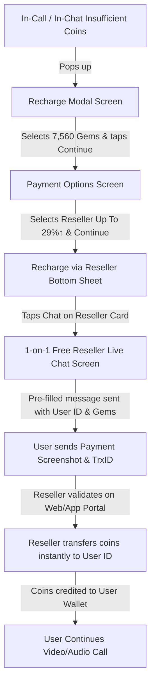

# ChinChins Live - Payment Options & Reseller System RESTful API Documentation

This document provides complete, production-ready specifications for Flutter mobile app developers and backend integrators to implement the **In-App Recharge Flow, Payment Options, Reseller Bottom Sheet, 1-on-1 Free Reseller Chat, and Instant Coin Transfer System**.

---

## 📱 Complete User Flow Overview



---

## 🔑 Authentication & Headers

All API endpoints accept standard Sanctum Bearer tokens and resilient headers:

```http
Authorization: Bearer <user_or_reseller_token>
X-User-Id: <user_id_or_account_id>
Content-Type: application/json
Accept: application/json
```

---

## 💎 Screen 1: In-App & In-Call Recharge Modal

### 1.1 Get Recharge Modal Data & Coin Packages
Retrieves dynamic teaser text, active coin packages with discount badges, user's current gem balance, and target host info.

- **Method:** `GET`
- **Endpoint:** `/api/recharge/modal-data` *(or `/api/coin-packages/recharge-modal`)*
- **Query Parameters:**
  - `receiver_id` *(optional)*: Target streamer / host ID if triggered inside a call.
  - `action` *(optional)*: `'call'` or `'chat'`.

#### Response Example (`200 OK`):
```json
{
  "status": true,
  "message": "Recharge modal data retrieved successfully.",
  "user_gems": 60,
  "wallet_label": "My Gems",
  "button_text": "Continue",
  "modal": {
    "title": "I want to talk more with you. Recharge and call me back~",
    "user_gems_text": "My Gems: 60",
    "user_gems": 60,
    "default_selected_package_id": 1,
    "button_text": "Continue",
    "packages": [
      {
        "id": 1,
        "title": "7560 Coins",
        "coins": 7560,
        "bonus_coins": 0,
        "total_coins": 7560,
        "formatted_coins": "7,560",
        "price": 150.00,
        "price_bdt": 150.00,
        "formatted_price": "BDT 150.00",
        "badge": "50%off ONCE",
        "badge_color": "orange",
        "icon_url": "https://chinchins.live/assets/images/coins/pack_1.png",
        "is_popular": true,
        "is_once_offer": true
      },
      {
        "id": 2,
        "title": "8100 Coins",
        "coins": 8100,
        "bonus_coins": 0,
        "total_coins": 8100,
        "formatted_coins": "8,100",
        "price": 300.00,
        "price_bdt": 300.00,
        "formatted_price": "BDT 300.00",
        "badge": "17%off",
        "badge_color": "pink",
        "icon_url": "https://chinchins.live/assets/images/coins/pack_2.png",
        "is_popular": false,
        "is_once_offer": false
      },
      {
        "id": 3,
        "title": "16380 Coins",
        "coins": 16380,
        "bonus_coins": 0,
        "total_coins": 16380,
        "formatted_coins": "16,380",
        "price": 600.00,
        "price_bdt": 600.00,
        "formatted_price": "BDT 600.00",
        "badge": "17%off",
        "badge_color": "pink",
        "icon_url": "https://chinchins.live/assets/images/coins/pack_3.png"
      }
    ]
  }
}
```

---

## 💳 Screen 2: Payment Options Screen

### 2.1 Get Payment Options
Displays available checkout channels including **bKash, Nagad, Google Play, and Reseller (with `Up To 29%↑` badge)**.

- **Method:** `GET`
- **Endpoint:** `/api/payment-options`
- **Query Parameters:**
  - `package_id`: Selected coin package ID (e.g., `1`)
  - `amount`: Package price in BDT (e.g., `150.00`)
  - `coins`: Gems amount (e.g., `7560`)

#### Response Example (`200 OK`):
```json
{
  "status": true,
  "message": "Payment options retrieved successfully.",
  "package_id": 1,
  "amount": 150.00,
  "coins": 7560,
  "formatted_amount": "BDT 150.00",
  "header_title": "Payment options",
  "options_title": "Options for you",
  "button_text": "Continue",
  "default_selected": "reseller",
  "options": [
    {
      "id": 1,
      "key": "bkash",
      "name": "Bkash",
      "type": "gateway",
      "account_type": "Personal / Merchant",
      "account_number": "01706640864",
      "icon": "https://chinchins.live/assets/images/gateways/bkash.png",
      "badge": null,
      "instructions": "Send money to our bKash number."
    },
    {
      "id": 2,
      "key": "nagad",
      "name": "Nagad",
      "type": "gateway",
      "account_type": "Personal / Merchant",
      "account_number": "01706640864",
      "icon": "https://chinchins.live/assets/images/gateways/nagad.png",
      "badge": null,
      "instructions": "Send money to our Nagad number."
    },
    {
      "id": "google_play",
      "key": "google_play",
      "name": "Google Play",
      "type": "in_app_purchase",
      "account_type": "Official In-App Store",
      "icon": "https://upload.wikimedia.org/wikipedia/commons/7/7a/Google_Play_2022_logo.svg",
      "badge": null,
      "instructions": "Instant Google Play in-app purchase."
    },
    {
      "id": "reseller",
      "key": "reseller",
      "name": "Reseller",
      "type": "reseller",
      "account_type": "Direct Agent Chat",
      "icon": "https://ui-avatars.com/api/?name=Reseller&background=1e1b4b&color=fbbf24&bold=true",
      "badge": "Up To 29%↑",
      "badge_color": "#ef4444",
      "active_count": 3,
      "instructions": "Recharge via authorized live resellers with exclusive discounts."
    }
  ]
}
```

---

## 👥 Screen 3: Recharge via Reseller Bottom Sheet

### 3.1 List Authorized Resellers
Pops up when "Reseller" option is selected. Shows reseller online status, sales record in diamonds, success rate, and "Chat" CTA.

- **Method:** `GET`
- **Endpoint:** `/api/resellers`
- **Query Parameters:**
  - `coins`: Selected gems count (e.g. `7560`)

#### Response Example (`200 OK`):
```json
{
  "status": true,
  "message": "Resellers retrieved successfully.",
  "default_badge": "Up To 29%↑",
  "bottom_sheet": {
    "header_title": "Recharge via Reseller",
    "sub_title": "Fast🔥 & flexible🔥 & cheaper option",
    "help_text": "Need help?",
    "button_text": "Chat"
  },
  "data": [
    {
      "id": 1,
      "reseller_id": "595082249",
      "account_id": "595082249",
      "name": "MURAD COINS RESELLER",
      "avatar": "https://chinchins.live/uploads/reseller/murad_avatar.jpg",
      "avatar_url": "https://chinchins.live/uploads/reseller/murad_avatar.jpg",
      "level": "Lv5",
      "location": "Dhaka, Bangladesh",
      "age": 27,
      "gender": "male",
      "phone": "01848340232",
      "bio": "কয়েন রিচার্জ, হোস্টিং এবং বিভিন্ন ধরণের গিফট ক্রয় করা হয়\nযোগাযোগ ০১৮৪৮৩৪০২৩২\nহোস্টিং স্যালারি তুলনামূলক বেশি দেওয়া হয়",
      "discount_tag": "Up To 29%↑",
      "badge_title": "Diamond Reseller",
      "sales": 15549000,
      "sales_diamonds": 15549000,
      "formatted_sales": "💎 15,549,000",
      "success_rate": "91.79%",
      "is_online": true,
      "status_text": "Online",
      "prefill_message": "Hello! My user ID is 266813634. I want to recharge 7560 gems. How much should I pay? 【GIVE THE BEST DISCOUNT 💎DIAMOND💎】"
    }
  ]
}
```

---

## 💬 Screen 4: 1-on-1 Free Reseller Live Chat Screen

### 4.1 Chat Rules & Policies
1. **Free of Charge:** Chatting with a Reseller is **100% FREE** (NO coins/gems deducted for sending messages, voice notes, or photos).
2. **Privacy Isolation:** Each user's chat is completely private between that specific user and that specific reseller.
3. **Auto Pre-fill Message:** When opening the chat, the input is pre-populated with:
   `Hello! My user ID is {account_id}. I want to recharge {gems} gems. How much should I pay? 【GIVE THE BEST DISCOUNT 💎DIAMOND💎】`

---

### 4.2 Fetch 1-on-1 Chat History
- **Method:** `GET`
- **Endpoint:** `/api/resellers/{reseller_id}/messages` *(or `/api/reseller/chat/{reseller_id}`)*

#### Response Example (`200 OK`):
```json
{
  "status": true,
  "message": "Chat messages retrieved successfully.",
  "reseller": {
    "id": 1,
    "name": "MURAD COINS RESELLER",
    "avatar": "https://chinchins.live/uploads/reseller/murad_avatar.jpg",
    "level": "Lv5",
    "is_online": true,
    "status_text": "Online",
    "discount_tag": "Up To 29%↑"
  },
  "user": {
    "id": 42,
    "account_id": "266813634",
    "name": "Nazmul Hossain",
    "avatar": "https://chinchins.live/uploads/avatars/u42.jpg",
    "coins": 60
  },
  "data": [
    {
      "id": 101,
      "reseller_id": 1,
      "user_id": 42,
      "sender_type": "user",
      "is_me": true,
      "type": "text",
      "message": "Hello! My user ID is 266813634. I want to recharge 7560 gems. How much should I pay? 【GIVE THE BEST DISCOUNT 💎DIAMOND💎】",
      "media_url": null,
      "duration": null,
      "coins_amount": 7560,
      "is_read": true,
      "created_at": "2026-09-09T04:59:00+06:00",
      "formatted_time": "04:59 AM"
    },
    {
      "id": 102,
      "reseller_id": 1,
      "user_id": 42,
      "sender_type": "reseller",
      "is_me": false,
      "type": "text",
      "message": "Hello Brother! For 7,560 gems, send ৳140 to bKash Personal: 01848340232 with your User ID.",
      "media_url": null,
      "duration": null,
      "coins_amount": null,
      "is_read": true,
      "created_at": "2026-09-09T05:00:15+06:00",
      "formatted_time": "05:00 AM"
    }
  ]
}
```

---

### 4.3 Send Message in Chat (Text, Image/Screenshot, Voice Note)
- **Method:** `POST`
- **Endpoint:** `/api/reseller/chat/send` *(or `/api/resellers/{reseller_id}/messages`)*
- **Content-Type:** `multipart/form-data` or `application/json`

#### Request Parameters:
| Field | Type | Required | Description |
|---|---|---|---|
| `reseller_id` | integer | Yes | Target Reseller ID |
| `message` | string | Optional | Text message content |
| `type` | string | Optional | `'text'`, `'image'`, `'voice'`, `'gift'` |
| `image` / `screenshot` | file | Optional | Payment proof screenshot / image |
| `voice` / `audio` | file | Optional | Voice recording audio file (mp3, m4a, aac) |
| `duration` | integer | Optional | Voice duration in seconds |
| `coins_amount` | integer | Optional | Requested gems amount (e.g. `7560`) |

#### Response Example (`201 Created`):
```json
{
  "status": true,
  "message": "Message sent successfully.",
  "data": {
    "id": 103,
    "reseller_id": 1,
    "user_id": 42,
    "sender_type": "user",
    "is_me": true,
    "type": "image",
    "message": "Sent ৳140 via bKash. TrxID: 9J8A7K21X",
    "media_url": "https://chinchins.live/uploads/reseller/chat_1725849920.png",
    "duration": null,
    "coins_amount": 7560,
    "is_read": false,
    "created_at": "2026-09-09T05:02:00.000000Z",
    "formatted_time": "05:02 AM"
  }
}
```

---

### 4.4 Upload Media Endpoint (Standalone)
- **Method:** `POST`
- **Endpoint:** `/api/reseller/chat/upload`
- **Form-Data:** `file` (Image or Audio file)

#### Response Example:
```json
{
  "status": true,
  "message": "Media uploaded successfully.",
  "media_url": "https://chinchins.live/uploads/reseller/img_1725850012.png",
  "relative_path": "uploads/reseller/img_1725850012.png",
  "type": "image"
}
```

---

## ⚡ Screen 5: Reseller Operations & Coin Transfer APIs

### 5.1 Validate User ID / Account ID
Before transferring coins, reseller validates the user's existence in real-time.

- **Method:** `POST`
- **Endpoint:** `/api/reseller/validate-user`
- **Request Body:**
```json
{
  "account_id": "266813634"
}
```

#### Response Example (`200 OK`):
```json
{
  "status": true,
  "message": "User found",
  "user": {
    "id": 42,
    "account_id": "266813634",
    "name": "Nazmul Hossain",
    "avatar": "https://chinchins.live/uploads/avatars/u42.jpg",
    "level": "Lv.5",
    "coins": 60,
    "country": "Bangladesh"
  }
}
```

---

### 5.2 Execute Instant Coin Transfer to User
Atomically transfers gems from reseller stock to user's wallet.

- **Method:** `POST`
- **Endpoint:** `/api/reseller/transfer-coins`
- **Headers:** `Authorization: Bearer <reseller_token>` or `X-Reseller-Id: 1`
- **Request Body:**
```json
{
  "target_account_id": "266813634",
  "coins": 7560,
  "amount_bdt": 140.00,
  "payment_method": "bKash",
  "transaction_id": "9J8A7K21X",
  "notes": "Recharged via live chat discount"
}
```

#### Response Example (`200 OK`):
```json
{
  "status": true,
  "message": "Successfully transferred 7,560 gems to Nazmul Hossain!",
  "data": {
    "transfer_id": 88,
    "coins_transferred": 7560,
    "user_account_id": "266813634",
    "user_name": "Nazmul Hossain",
    "reseller_remaining_coins": 42439
  }
}
```

---

## 🎨 Flutter Developer Implementation Blueprint

### 1. Data Models (`Dart`)

```dart
class PaymentOption {
  final dynamic id;
  final String key;
  final String name;
  final String type;
  final String? icon;
  final String? badge;

  PaymentOption({
    required this.id,
    required this.key,
    required this.name,
    required this.type,
    this.icon,
    this.badge,
  });

  factory PaymentOption.fromJson(Map<String, dynamic> json) {
    return PaymentOption(
      id: json['id'],
      key: json['key'] ?? '',
      name: json['name'] ?? '',
      type: json['type'] ?? 'gateway',
      icon: json['icon'],
      badge: json['badge'],
    );
  }
}

class ResellerModel {
  final int id;
  final String resellerId;
  final String name;
  final String avatar;
  final String level;
  final String location;
  final int sales;
  final String formattedSales;
  final String successRate;
  final bool isOnline;
  final String prefillMessage;

  ResellerModel({
    required this.id,
    required this.resellerId,
    required this.name,
    required this.avatar,
    required this.level,
    required this.location,
    required this.sales,
    required this.formattedSales,
    required this.successRate,
    required this.isOnline,
    required this.prefillMessage,
  });

  factory ResellerModel.fromJson(Map<String, dynamic> json) {
    return ResellerModel(
      id: json['id'] ?? 0,
      resellerId: json['reseller_id'] ?? json['account_id'] ?? '',
      name: json['name'] ?? '',
      avatar: json['avatar_url'] ?? json['avatar'] ?? '',
      level: json['level'] ?? 'Lv5',
      location: json['location'] ?? 'Dhaka',
      sales: json['sales'] ?? 0,
      formattedSales: json['formatted_sales'] ?? '💎 0',
      successRate: json['success_rate'] ?? '95%',
      isOnline: json['is_online'] ?? false,
      prefillMessage: json['prefill_message'] ?? '',
    );
  }
}
```

### 2. Opening the 1-on-1 Chat Screen (`Flutter`)

```dart
void openResellerChat(BuildContext context, ResellerModel reseller, {String? prefill}) {
  Navigator.push(
    context,
    MaterialPageRoute(
      builder: (context) => ResellerChatScreen(
        reseller: reseller,
        initialMessage: prefill ?? reseller.prefillMessage,
      ),
    ),
  );
}
```

---

## 🌐 Web Portal URLs & Admin Access

- **Reseller Portal URL:** `http://127.0.0.1:8000/reseller/login` (or `/reseller/login` on live server)
- **Admin Resellers Management:** `http://127.0.0.1:8000/admin/resellers`
- **Admin Reseller Chat:** `http://127.0.0.1:8000/admin/resellers/chat`
- **Demo Reseller Account:**
  - Email: `murad@chinchins.live`
  - Password: `password123`
