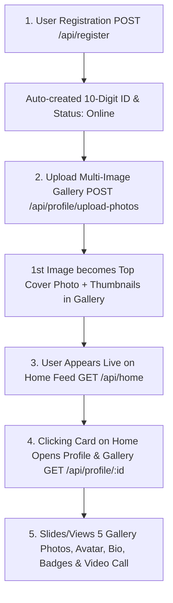

# Chinchins Live — RESTful API Documentation & Developer Guide

This document contains complete, dynamic, database-driven RESTful API specifications for the **Chinchins Live** Mobile App (Flutter / Android / iOS) and Web Frontend developers.

> **💡 Zero Hardcoded Data Guarantee:**  
> All data (Home feed, user profiles, online/offline statuses, age, country, multi-image gallery photos, and avatars) are 100% dynamic and pulled directly from the live database.

---

## 🌐 Base URL
```http
Production:  https://your-domain.com/api
Development: http://127.0.0.1:8000/api
```

---

## 🔑 Authentication Architecture
- Public routes (`/register`, `/login`, `/home`, `/users`, `/profile/{id}`) do not require a token.
- Protected routes require a Bearer token in the request header:
```http
Authorization: Bearer <AUTH_TOKEN>
Accept: application/json
```

---

## 📱 Core User & App Flow (End-to-End)



---

## 📑 API Endpoints Summary

| Method | Endpoint | Auth Required | Description |
| :--- | :--- | :---: | :--- |
| **POST** | `/api/register` | No | Register new host/user (First/Last Name, Phone, Age, Country, Password) |
| **POST** | `/api/login` | No | Login with Phone, Email, or 10-digit Account ID |
| **GET** | `/api/home` *(or `/api/users`)* | No | **Home Feed** (100% dynamic database list of live streamers) |
| **GET** | `/api/profile/{id}` | No | View full Profile & Gallery by User ID or 10-digit Account ID |
| **GET** | `/api/profile/me` *(or `/api/user`)* | **Yes** | Get current logged-in user profile ("Me" tab) |
| **POST** | `/api/profile/update` | **Yes** | Update bio, age, country, nickname, level, rate, etc. |
| **POST** | `/api/profile/upload-photos` | **Yes** | Upload multiple gallery photos (1st photo automatically becomes cover) |
| **POST** | `/api/profile/upload-avatar` | **Yes** | Upload circular profile avatar |
| **POST** | `/api/profile/upload-cover` | **Yes** | Upload background cover photo |
| **POST** | `/api/profile/delete-photo` | **Yes** | Delete a photo from gallery |
| **POST** | `/api/profile/status` | **Yes** | Toggle Online/Offline status (`Online` vs `Offline`) |
| **POST** | `/api/logout` | **Yes** | Logout & revoke access token |

---

## 1. 📝 User Registration API

Creates a new user in the database, automatically generates a unique 10-digit `account_id`, sets status to `Online` (`is_active: true`), and returns an authentication Bearer Token.

### **Endpoint**
`POST /api/register`

### **Headers**
```http
Content-Type: application/json
Accept: application/json
```

### **Request Body Parameters**

| Field | Type | Required | Description | Example |
| :--- | :--- | :---: | :--- | :--- |
| `first_name` | `string` | **Yes** | User's first name | `"Ayeena"` |
| `last_name` | `string` | **Yes** | User's last name | `"Khan"` |
| `phone` *(or `phone_number`)* | `string` | **Yes** | Unique phone number | `"+8801712345678"` |
| `password` | `string` | **Yes** | Minimum 6 characters | `"secretPassword123"` |
| `password_confirmation` *(or `confirm_password`)* | `string` | **Yes** | Must match `password` | `"secretPassword123"` |
| `country` | `string` | No | Country name (e.g. `"Bangladesh"`, `"Pakistan"`) | `"Bangladesh"` |
| `age` | `integer` | No | Age (between 18 and 120, Default: `27`) | `27` |
| `nickname` | `string` | No | Display name / nickname (Default: `first_name`) | `"Ayeena04"` |
| `gender` | `string` | No | `"female"`, `"male"`, or `"other"` (Default: `"female"`) | `"female"` |
| `email` | `string` | No | Optional email. Auto-generated if omitted. | `"ayeena@example.com"` |
| `city` | `string` | No | City name | `"Dhaka"` |
| `introduction` | `string` | No | Profile bio | `"Sweet girl looking for honest talk ❤️"` |
| `languages` | `array` | No | Spoken languages | `["English", "Bengali"]` |
| `tags` | `array` | No | Interests / tags | `["Live video", "Music"]` |
| `video_call_rate` | `integer` | No | Diamond rate per minute (Default: `1800`) | `1800` |

### **Example Request**
```json
{
  "first_name": "Ayeena",
  "last_name": "Khan",
  "nickname": "Ayeena04",
  "phone": "+8801712345678",
  "country": "Bangladesh",
  "age": 27,
  "gender": "female",
  "password": "secretPassword123",
  "password_confirmation": "secretPassword123"
}
```

### **Success Response (HTTP 201 Created)**
```json
{
  "status": true,
  "message": "Registration successful",
  "data": {
    "user": {
      "id": 15,
      "account_id": "602281635",
      "first_name": "Ayeena",
      "last_name": "Khan",
      "name": "Ayeena Khan",
      "nickname": "Ayeena04",
      "display_name": "Ayeena04",
      "phone": "+8801712345678",
      "email": "8801712345678@user.chinchins.live",
      "country": "Bangladesh",
      "city": null,
      "gender": "female",
      "age": 27,
      "is_active": true,
      "is_online": true,
      "status_text": "Online",
      "is_verified": true,
      "level": "Lv4",
      "video_call_rate": 1800,
      "close_friends_count": 0,
      "avatar_url": null,
      "cover_photo_url": null,
      "gallery_image_urls": [],
      "introduction": "Sweet girl looking for honest talk ❤️",
      "languages": ["English", "Bengali"],
      "tags": ["Live video", "Music"],
      "created_at": "2026-08-25T20:25:00.000000Z",
      "updated_at": "2026-08-25T20:25:00.000000Z"
    },
    "token": "1|5gXQyV8tP9...your_sanctum_bearer_token...",
    "token_type": "Bearer"
  }
}
```

---

## 2. 🏠 Home Page Feed API (100% Live Database Data)

Fetches active streamers directly from the database for the **Home / Hot / For You** screen.

### **Endpoint**
`GET /api/home` *(or `GET /api/users`)*

### **Query Parameters (Optional)**
| Parameter | Type | Description | Example |
| :--- | :--- | :--- | :--- |
| `is_active` | `boolean` | Filter by online status (`1` = Online only) | `?is_active=1` |
| `country` | `string` | Filter by country | `?country=Bangladesh` |
| `gender` | `string` | Filter by gender (`female`, `male`) | `?gender=female` |
| `search` | `string` | Search query for name, nickname, ID, country | `?search=Ayeena` |
| `page` | `integer` | Page number | `?page=1` |
| `per_page` | `integer` | Items per page (Default: `20`) | `?per_page=20` |

### **Success Response (HTTP 200 OK)**
```json
{
  "status": true,
  "message": "Home feed loaded successfully from database",
  "data": {
    "users": [
      {
        "id": 15,
        "account_id": "602281635",
        "display_name": "Ayeena04",
        "avatar_url": "https://your-domain.com/storage/profiles/15/avatar.jpg",
        "cover_photo_url": "https://your-domain.com/storage/profiles/15/gallery/img1.jpg",
        "gallery_image_urls": [
          "https://your-domain.com/storage/profiles/15/gallery/img1.jpg",
          "https://your-domain.com/storage/profiles/15/gallery/img2.jpg",
          "https://your-domain.com/storage/profiles/15/gallery/img3.jpg",
          "https://your-domain.com/storage/profiles/15/gallery/img4.jpg",
          "https://your-domain.com/storage/profiles/15/gallery/img5.jpg"
        ],
        "country": "Bangladesh",
        "age": 27,
        "gender": "female",
        "level": "Lv4",
        "is_active": true,
        "is_online": true,
        "status_text": "Online",
        "is_verified": true,
        "video_call_rate": 1800,
        "close_friends_count": 0,
        "introduction": "Sweet girl looking for honest talk ❤️"
      }
    ],
    "total": 1,
    "current_page": 1,
    "last_page": 1,
    "per_page": 20
  }
}
```

---

## 3. 👤 User Profile & Gallery API

Triggered when a user clicks on any card from the Home feed or opens the "Me" tab.

### **A. View Any Host/User Profile (Public)**
`GET /api/profile/{id}`
*(Pass either the user's database `id` or the 10-digit `account_id`)*

### **B. View Current User's Profile ("Me" Tab)**
`GET /api/profile/me` *(Requires `Authorization: Bearer <TOKEN>`)*

### **Success Response (HTTP 200 OK)**
```json
{
  "status": true,
  "data": {
    "user": {
      "id": 15,
      "account_id": "602281635",
      "display_name": "Ayeena04",
      "avatar_url": "https://your-domain.com/storage/profiles/15/avatar.jpg",
      "cover_photo_url": "https://your-domain.com/storage/profiles/15/gallery/img1.jpg",
      "gallery_image_urls": [
        "https://your-domain.com/storage/profiles/15/gallery/img1.jpg",
        "https://your-domain.com/storage/profiles/15/gallery/img2.jpg",
        "https://your-domain.com/storage/profiles/15/gallery/img3.jpg",
        "https://your-domain.com/storage/profiles/15/gallery/img4.jpg",
        "https://your-domain.com/storage/profiles/15/gallery/img5.jpg"
      ],
      "country": "Bangladesh",
      "city": "Dhaka",
      "gender": "female",
      "age": 27,
      "level": "Lv4",
      "is_active": true,
      "is_online": true,
      "status_text": "Online",
      "is_verified": true,
      "close_friends_count": 0,
      "video_call_rate": 1800,
      "introduction": "Sweet girl looking for honest talk ❤️",
      "languages": ["English", "Bengali"],
      "tags": ["Live video", "Music"]
    }
  }
}
```

---

## 4. 🖼️ Multi-Image Gallery & Photo Upload APIs

### **A. Upload Multiple Gallery Photos**
- **Endpoint**: `POST /api/profile/upload-photos`
- **Headers**: `Authorization: Bearer <TOKEN>`, `Content-Type: multipart/form-data`
- **Body**: `photos[]` (Array of image files)
- **Automatic Cover Behavior**: The first uploaded gallery photo is automatically set as the top background `cover_photo`!

### **B. Upload Dedicated Avatar Photo**
- **Endpoint**: `POST /api/profile/upload-avatar`
- **Body**: `avatar` (Image file)

### **C. Upload Dedicated Cover Photo**
- **Endpoint**: `POST /api/profile/upload-cover`
- **Body**: `cover_photo` (Image file)

### **D. Delete a Photo from Gallery**
- **Endpoint**: `POST /api/profile/delete-photo`
- **Body**:
```json
{
  "photo": "profiles/15/gallery/img3.jpg"
}
```

---

## 5. 🟢 Toggle Online / Offline Status API

Changes the user's live status between `Online` and `Offline`.

### **Endpoint**
`POST /api/profile/status`

### **Request Body (Optional - Toggles automatically if omitted)**
```json
{
  "is_active": true
}
```

### **Response (HTTP 200 OK)**
```json
{
  "status": true,
  "message": "Status updated to Active",
  "data": {
    "is_active": true,
    "is_online": true,
    "status": "Active"
  }
}
```

---

## 6. 🔐 User Login API

Authenticate using Phone number, Email, or 10-digit Account ID along with Password.

### **Endpoint**
`POST /api/login`

### **Request Body**
```json
{
  "identifier": "+8801712345678",
  "password": "secretPassword123"
}
```

### **Response (HTTP 200 OK)**
```json
{
  "status": true,
  "message": "Login successful",
  "data": {
    "user": { ... },
    "token": "2|9a8Bz...",
    "token_type": "Bearer"
  }
}
```

---

## 📱 Complete Flutter / Dart Integration Service

```dart
import 'dart:convert';
import 'dart:io';
import 'package:http/http.dart' as http;

class ChinchinsApi {
  static const String baseUrl = 'http://127.0.0.1:8000/api';

  // 1. User Registration
  static Future<Map<String, dynamic>> register({
    required String firstName,
    required String lastName,
    required String phone,
    required String password,
    required String country,
    required int age,
    String? nickname,
  }) async {
    final response = await http.post(
      Uri.parse('$baseUrl/register'),
      headers: {'Content-Type': 'application/json', 'Accept': 'application/json'},
      body: jsonEncode({
        'first_name': firstName,
        'last_name': lastName,
        'phone': phone,
        'country': country,
        'age': age,
        'nickname': nickname ?? firstName,
        'password': password,
        'password_confirmation': password,
      }),
    );
    return jsonDecode(response.body);
  }

  // 2. Fetch Home Feed (Real Database Live Hosts)
  static Future<List<dynamic>> fetchHomeFeed({int page = 1}) async {
    final response = await http.get(
      Uri.parse('$baseUrl/home?page=$page&is_active=1'),
      headers: {'Accept': 'application/json'},
    );
    final data = jsonDecode(response.body);
    return data['data']['users'] ?? [];
  }

  // 3. Fetch Host Profile & Gallery by ID
  static Future<Map<String, dynamic>> fetchProfile(dynamic idOrAccountId) async {
    final response = await http.get(
      Uri.parse('$baseUrl/profile/$idOrAccountId'),
      headers: {'Accept': 'application/json'},
    );
    final data = jsonDecode(response.body);
    return data['data']['user'];
  }

  // 4. Upload Multiple Gallery Photos
  static Future<Map<String, dynamic>> uploadGalleryPhotos({
    required String token,
    required List<File> imageFiles,
  }) async {
    var request = http.MultipartRequest('POST', Uri.parse('$baseUrl/profile/upload-photos'));
    request.headers['Authorization'] = 'Bearer $token';
    request.headers['Accept'] = 'application/json';

    for (var file in imageFiles) {
      request.files.add(await http.MultipartFile.fromPath('photos[]', file.path));
    }

    var streamedResponse = await request.send();
    var response = await http.Response.fromStream(streamedResponse);
    return jsonDecode(response.body);
  }

  // 5. Toggle Online / Offline Status
  static Future<bool> setOnlineStatus({required String token, required bool isOnline}) async {
    final response = await http.post(
      Uri.parse('$baseUrl/profile/status'),
      headers: {
        'Authorization': 'Bearer $token',
        'Content-Type': 'application/json',
        'Accept': 'application/json',
      },
      body: jsonEncode({'is_active': isOnline}),
    );
    final data = jsonDecode(response.body);
    return data['status'] == true;
  }
}
```
