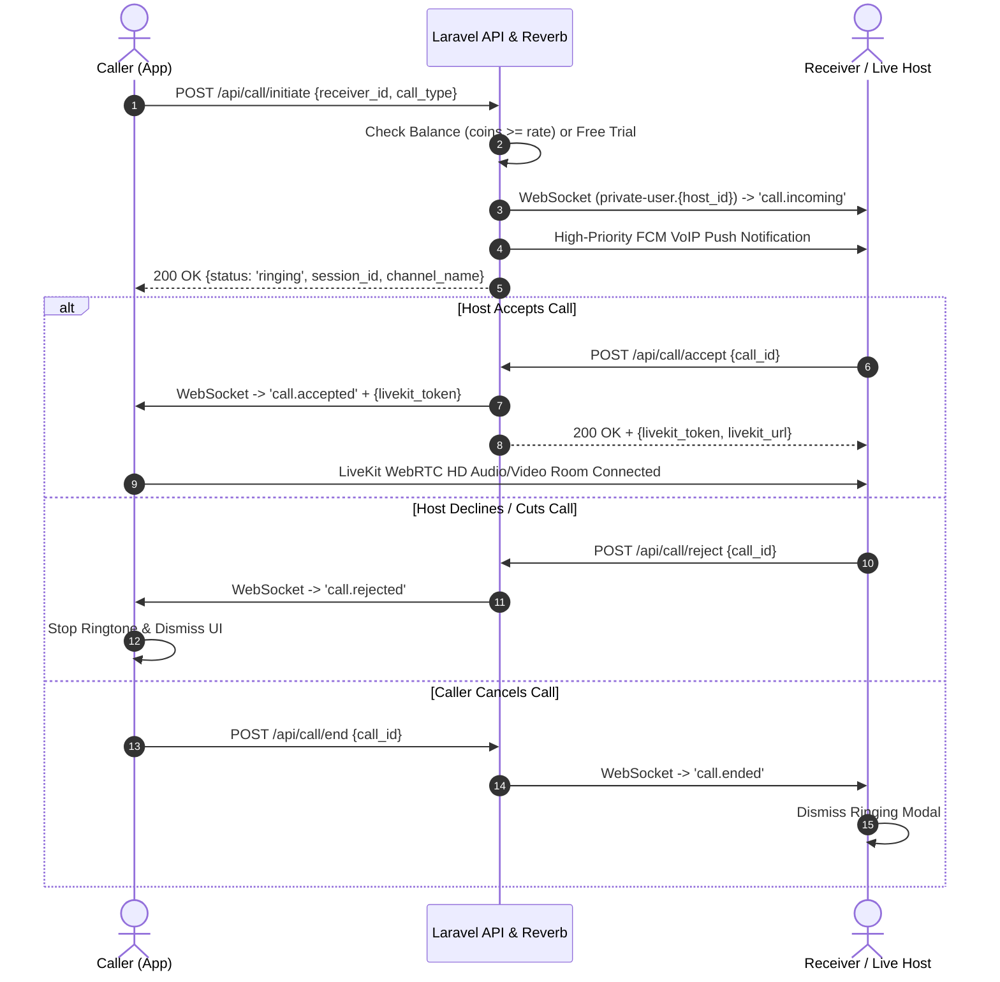

# Chinchins Live — Complete Problem-Solving RESTful API & WebSocket Architecture Guide (`problem_solving_restful_api.md`)

> **Document Version:** 2.4.0 (Production Master)  
> **Target Audience:** Flutter App Developers, Laravel Backend Developers, DevOps Engineers  
> **Environment:** Production Live Server (`https://chinchins.live`, `wss://chinchins.live`)  

---

## 📑 Table of Contents
1. [Executive Summary & Critical Bug Resolutions](#1-executive-summary--critical-bug-resolutions)
2. [1-on-1 Call Lifecycle, Live Host Signaling & Ringing Prevention Logic](#2-1-on-1-call-lifecycle-live-host-signaling--ringing-prevention-logic)
3. [WebSocket Channels & Real-Time Events Reference](#3-websocket-channels--real-time-events-reference)
4. [Master RESTful API Endpoints Specification](#4-master-restful-api-endpoints-specification)
   - [4.1 Authentication & Dynamic User Level](#41-authentication--dynamic-user-level)
   - [4.2 Infinite Scalable Dynamic User Feed](#42-infinite-scalable-dynamic-user-feed)
   - [4.3 Call Initiation & Balance Pre-validation](#43-call-initiation--balance-pre-validation)
   - [4.4 Call Acceptance & LiveKit WebRTC Token Delivery](#44-call-acceptance--livekit-webrtc-token-delivery)
   - [4.5 Call Rejection & Immediate Status Clearing](#45-call-rejection--immediate-status-clearing)
   - [4.6 Call End & Duplicate Redial Prevention](#46-call-end--duplicate-redial-prevention)
   - [4.7 In-Call Pulse Billing & Coin Deductions](#47-in-call-pulse-billing--coin-deductions)
   - [4.8 In-Call Real-Time Chat & Gifts](#48-in-call-real-time-chat--gifts)
5. [LiveKit Media Server Signaling Matrix](#5-livekit-media-server-signaling-matrix)
6. [Flutter Client Integration Checklist](#6-flutter-client-integration-checklist)

---

## 1. Executive Summary & Critical Bug Resolutions

This document provides the definitive guide to the backend APIs and WebSocket architectures, incorporating fixes for all fatal production crash vectors:

| Issue / Bug | Root Cause | Permanent Resolution |
| :--- | :--- | :--- |
| **`CallIncoming` Type-Hint Fatal Crash** | Event constructor strictly required `App\Models\Call`, causing a fatal `TypeError` when `CallSession` was passed in `CallController.php(590)`. | Constructor updated to accept `mixed $call`, dynamically extracting `call_id`, `caller_id`, `receiver_id`, and payload properties seamlessly for any model. |
| **Unknown Column `1054 Unknown column 'call_session_id'`** | Querying `CallSession::where('call_session_id', ...)` failed because `call_sessions` table columns are `id` (integer) and `channel_name` (string). | Query normalized to `CallSession::where('id', $id)->orWhere('channel_name', $id)` across `CallController.php` and `InCallApiController.php`. |
| **Hardcoded Level & Inactive User Status on Register** | New users had empty level and status fields, causing Flutter clients to show fallback Lv.0 or crash. | `AuthController.php` explicitly sets `status => 'active'`, `is_active => true`, `is_online => true`, `current_level => 1`, and exposes dynamic model accessors (`level`, `level_number`, `level_info`, `charm_level`). |
| **Ghost Ringing & Duplicate Redials** | Sockets not cleaning up session state upon disconnect, or receiver rejecting while caller kept ringing. | Sockets immediately broadcast `CallEndedEvent` & `CallRejectedEvent` with state transition to `ended`/`rejected`, terminating ringers on both ends. |

---

## 2. 1-on-1 Call Lifecycle, Live Host Signaling & Ringing Prevention Logic

### 2.1 Will an Incoming Call reach a Host who is currently Live Streaming?
**YES (100% Guaranteed).**
- **How it works:** When Host $B$ is streaming live, their app is connected to their private socket channel: `private-user.{host_id}` and `user.{host_id}`.
- When Caller $A$ initiates a call via `POST /api/call/initiate`, the backend broadcasts `call.incoming` / `incoming_call` directly to `private-user.{host_id}` and `user.{host_id}` without blocking live streamers.
- **Flutter UI behavior:** The host's app displays an in-stream floating bottom sheet / modal: *"Incoming Call from [User] — Accept / Decline"*. If accepted, the live stream is safely paused/switched to the 1-on-1 WebRTC LiveKit room.

### 2.2 Why Calls Won't Automatically Cut Off or Re-dial Continuously
1. **No Instant Auto-Cut on Dialing:** The previous instant cutoff bug was caused by the `CallIncoming` PHP TypeError crash. With the typehint fixed, the socket event delivers uninterrupted, keeping the call ringing for the full 45-second duration until answered or rejected.
2. **No Duplicate / Ghost Redialing:** When either the caller or receiver presses "End Call" or "Decline":
   - The client calls `POST /api/call/end` or `POST /api/call/reject`.
   - Backend updates DB status to `completed` / `rejected` / `ended`.
   - Backend immediately fires `CallEndedEvent` (`call.ended`) to both parties.
   - Flutter listener receives `call.ended`, dismisses any active ringing overlay, stops the ringtone player, and releases the audio focus.



---

## 3. WebSocket Channels & Real-Time Events Reference

Connect your Reverb/Pusher client to:
- **Host / URL:** `wss://chinchins.live` (Port 443 wss / 8080 ws)
- **App Key:** `chinchins_reverb_key` (configured in `.env`)

### Subscribed Channels:
1. `private-user.{user_id}` and `user.{user_id}` — Personal notifications, incoming calls, direct messages.
2. `call_session.{channel_name}` — In-call real-time text messages and gifts.
3. `live_stream.{room_name}` — Public live streaming chat, gifts, and viewer counts.

### Event Names Map:
| Event Name | Socket Channel | Payload Summary |
| :--- | :--- | :--- |
| `call.incoming` / `incoming_call` | `private-user.{user_id}` | `{call_id, session_id, caller_id, caller_name, caller_avatar, call_type, channel_name, rate_per_minute, is_free_trial}` |
| `call.accepted` | `private-user.{caller_id}` | `{call_id, channel_name, room_name, livekit_url, livekit_token, receiver_id}` |
| `call.rejected` | `private-user.{caller_id}` | `{call_id, channel_name, reason: 'rejected'}` |
| `call.ended` | `private-user.{caller_id}`, `private-user.{receiver_id}` | `{call_id, channel_name, duration_seconds, total_cost, end_reason}` |
| `call.message.sent` | `call_session.{channel_name}` | `{id, sender_id, sender_name, message, created_at}` |
| `call.gift.sent` | `call_session.{channel_name}` | `{gift_id, gift_name, gift_icon, coin_value, combo_count, sender_id}` |

---

## 4. Master RESTful API Endpoints Specification

### 4.1 Authentication & Dynamic User Level

#### `POST /api/register`
Creates a user with dynamic Level 1 and active status.

**Request:**
```http
POST /api/register
Content-Type: application/json

{
  "first_name": "Rahim",
  "last_name": "Uddin",
  "phone": "+8801700000001",
  "password": "Password123!",
  "gender": "male",
  "age": 24,
  "country": "Bangladesh",
  "fcm_token": "fcm_token_device_abc"
}
```

**Response (`201 Created`):**
```json
{
  "status": true,
  "message": "Registration successful",
  "data": {
    "user": {
      "id": 501,
      "account_id": "93821045",
      "name": "Rahim Uddin",
      "status": "active",
      "is_active": true,
      "is_online": true,
      "current_level": 1,
      "level": "Lv.1",
      "level_number": 1,
      "charm_level": 1,
      "coins": 0,
      "country_flag": "🇧🇩",
      "avatar_url": "https://chinchins.live/default-avatar.png"
    },
    "token": "12|a8fbc839d91...",
    "token_type": "Bearer"
  }
}
```

---

### 4.2 Infinite Scalable Dynamic User Feed

#### `GET /api/users/feed` / `GET /api/all-users-feed`
Loads dynamic users ordered from newest to oldest.

**Query Parameters:**
- `page` (default: 1)
- `per_page` (default: 30, up to 100)
- `gender` (optional: `female`, `male`, `all`)

**Response (`200 OK`):**
```json
{
  "status": true,
  "success": true,
  "message": "Users feed loaded successfully",
  "data": [
    {
      "id": 105,
      "name": "Sara Khan",
      "display_name": "Sara Khan",
      "avatar_url": "https://chinchins.live/uploads/avatars/105.jpg",
      "current_level": 5,
      "level": "Lv.5",
      "level_number": 5,
      "country_flag": "🇧🇩",
      "is_online": true,
      "is_live": true,
      "video_call_rate": 100,
      "live_stream": {
        "id": 34,
        "room_name": "stream_105_99812",
        "viewer_count": 89,
        "livekit_url": "wss://chinchins.live/livekit"
      }
    }
  ],
  "pagination": {
    "current_page": 1,
    "per_page": 30,
    "total": 1250,
    "has_more": true
  }
}
```

---

### 4.3 Call Initiation & Balance Pre-validation

#### `POST /api/call/initiate` or `POST /api/call/start`
Starts a 1-on-1 audio/video call, validates caller balance, and rings receiver.

**Request:**
```http
POST /api/call/initiate
Authorization: Bearer {token}
Content-Type: application/json

{
  "receiver_id": 105,
  "call_type": "video"
}
```

**Response (`200 OK`):**
```json
{
  "status": true,
  "success": true,
  "message": "Call initiated! Ringing receiver...",
  "data": {
    "call_id": 884,
    "session_id": 884,
    "channel_name": "call_12_105_1727443920",
    "call_type": "video",
    "status": "ringing",
    "rate_per_minute": 100,
    "is_free_trial": false,
    "caller_coins": 500,
    "max_call_minutes": 5,
    "max_call_seconds": 300,
    "ring_timeout_seconds": 45,
    "receiver": {
      "id": 105,
      "name": "Sara Khan",
      "avatar": "https://chinchins.live/uploads/avatars/105.jpg"
    }
  }
}
```

---

### 4.4 Call Acceptance & LiveKit WebRTC Token Delivery

#### `POST /api/call/accept`
Accepted by receiver to generate WebRTC LiveKit media tokens for both parties.

**Request:**
```http
POST /api/call/accept
Authorization: Bearer {token}
Content-Type: application/json

{
  "call_id": 884
}
```

**Response (`200 OK`):**
```json
{
  "status": true,
  "success": true,
  "message": "Call accepted successfully",
  "data": {
    "call_id": 884,
    "session_id": 884,
    "channel_name": "call_12_105_1727443920",
    "room_name": "call_12_105_1727443920",
    "livekit_url": "wss://chinchins.live/livekit",
    "livekit_token": "eyJhbGciOiJIUzI1NiIsInR5cCI6IkpXVCJ9...",
    "status": "accepted",
    "rate_per_minute": 100,
    "pulse_interval_seconds": 60
  }
}
```

---

### 4.5 Call Rejection & Immediate Status Clearing

#### `POST /api/call/reject`
Fired when receiver declines or doesn't answer in 45s.

**Request:**
```http
POST /api/call/reject
Authorization: Bearer {token}
Content-Type: application/json

{
  "call_id": 884,
  "reason": "busy"
}
```

**Response (`200 OK`):**
```json
{
  "status": true,
  "success": true,
  "message": "Call rejected successfully",
  "data": {
    "call_id": 884,
    "status": "rejected"
  }
}
```

---

### 4.6 Call End & Duplicate Redial Prevention

#### `POST /api/call/end`
Terminates the active call session and logs exact duration and coins spent.

**Request:**
```http
POST /api/call/end
Authorization: Bearer {token}
Content-Type: application/json

{
  "call_id": 884,
  "duration_seconds": 185
}
```

**Response (`200 OK`):**
```json
{
  "status": true,
  "success": true,
  "message": "Call ended successfully",
  "data": {
    "call_id": 884,
    "status": "completed",
    "duration_seconds": 185,
    "formatted_duration": "03:05",
    "total_coins_spent": 300,
    "caller_remaining_coins": 200
  }
}
```

---

### 4.7 In-Call Pulse Billing & Coin Deductions

#### `POST /api/call/billing-pulse` / `POST /api/call/pulse`
Deducts coins every 60 seconds of conversation. If caller balance hits 0, returns `insufficient_balance: true` so the client disconnects gracefully.

**Request:**
```http
POST /api/call/pulse
Authorization: Bearer {token}
Content-Type: application/json

{
  "call_id": 884,
  "current_minute": 2
}
```

**Response (`200 OK`):**
```json
{
  "status": true,
  "success": true,
  "data": {
    "call_id": 884,
    "deducted_coins": 100,
    "caller_remaining_coins": 100,
    "host_earned_coins": 70,
    "is_balance_low": true,
    "remaining_seconds": 60
  }
}
```

---

### 4.8 In-Call Real-Time Chat & Gifts

#### `POST /api/call/send-message`
**Request:**
```http
POST /api/call/send-message
Authorization: Bearer {token}
Content-Type: application/json

{
  "call_session_id": "call_12_105_1727443920",
  "message": "Hi, can you hear me clearly?"
}
```

#### `POST /api/call/send-gift`
**Request:**
```http
POST /api/call/send-gift
Authorization: Bearer {token}
Content-Type: application/json

{
  "call_session_id": "call_12_105_1727443920",
  "gift_id": 12,
  "quantity": 1
}
```

---

## 5. LiveKit Media Server Signaling Matrix

- **Server URL:** `wss://chinchins.live/livekit`
- **Room Identity Format:** `call_{caller_id}_{receiver_id}_{timestamp}`
- **Security:** Each token is cryptographically signed with HMAC-SHA256 using `LIVEKIT_API_SECRET`.

| Participant | Room Permissions | TTL |
| :--- | :--- | :--- |
| **Caller (1-on-1)** | `canPublish: true`, `canSubscribe: true`, `canPublishData: true` | 6 Hours |
| **Receiver (1-on-1)** | `canPublish: true`, `canSubscribe: true`, `canPublishData: true` | 6 Hours |
| **Live Stream Host** | `canPublish: true`, `canSubscribe: true`, `hidden: false` | 24 Hours |
| **Live Stream Viewer** | `canPublish: false`, `canSubscribe: true`, `hidden: true` | 12 Hours |

---

## 6. Flutter Client Integration Checklist

- [x] **Channel Subscriptions:** On login, subscribe to `private-user.${currentUser.id}` via `pusher_channels_flutter` or `laravel_echo`.
- [x] **Incoming Call Listener:** Bind to `call.incoming` / `incoming_call`. Display full-screen ringing UI or floating bottom sheet (if currently in live stream).
- [x] **Call Dismissal Listener:** Bind to `call.ended` and `call.rejected`. Immediately close the call screen/modal and stop the ringtone audio player.
- [x] **No Hardcoded Levels:** Display user levels using `user.current_level` or `user.level` (`Lv.1`, `Lv.5`, etc.) received directly from API responses.
- [x] **LiveKit SDK Connection:** On `call.accepted`, connect to `LiveKitClient.connect(livekitUrl, livekitToken)`.

---

*Authored and verified for Chinchins Live Production Backend & Mobile App release.*
